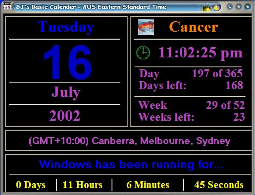



## BJ's Basic Calender  \(Updated\) Tue 16 July 2002

### Description

I accedently deleted BJ's Basic Calender instead of Editing it. Anyway...

Shows Current Date and Time in 12\24 format, Day of Year, Week of Year, Star Sign and picture for every month, Change Date & Time and timezone, Update Time with the Atomic Clock, (Thanks to em & John G Duffy for the atomic clock code), Shows Windows Running time, Change Colours, Add Shortcut to your private Startup menu, Has code ready to change screen res, (Not in use, Just un comment it), add app to run menu, Read readme.txt (for newbies). See Screen shot. That says most of it.

I guess i should now call it BJ's Advanced Calender!!!

Thanx BJ.

Comments & segestions Welcome.
 
### More Info
 

             |
---                |---
**Submitted On**   |2002-07-16 19:49:32
**By**             |[BJ](https://github.com/Planet-Source-Code/PSCIndex/blob/master/ByAuthor/bj.md)
**Level**          |Beginner
**User Rating**    |5.0 (10 globes from 2 users)
**Compatibility**  |VB 6\.0
**Category**       |[Math/ Dates](https://github.com/Planet-Source-Code/PSCIndex/blob/master/ByCategory/math-dates__1-37.md)
**World**          |[Visual Basic](https://github.com/Planet-Source-Code/PSCIndex/blob/master/ByWorld/visual-basic.md)
**Archive File**   |[BJ's\_Basic1067797162002\.zip](https://github.com/Planet-Source-Code/bj-bj-s-basic-calender-updated-tue-16-july-2002__1-36941/archive/master.zip)

